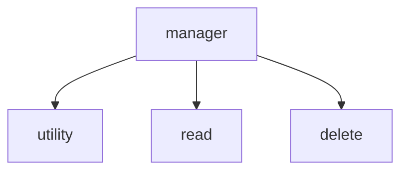

# manager bash task

## Overview

### requirements
The projects is intended to run on a **LINUX** machine, we specifically ran it on a virtual machine as is required by the course, but any linux machine should suffice

### how to run and download
To download please use the command `git clone` into your repository, it will download all the .sh files and the temporary files like .txt or .jpeg
When runnin you should only run the manager file which is called "folder\_task\_mgr.sh" and will run the other scripts with according to user requests.
You can run the mananger file by running ./folder\_task\_mgr.sh
### general information
The project itself is a small group assignment conducted by one of [appleseeds](https://appleseeds.org.il/) programs, specificaly the `aws re/start` program.

This program goes over the basics of linux command handling, and basic use aws.

After learning linux commands, we reached **Bash**, this project should sum the basic use of bash.

It includes if, loops(for, while), switch case, arithmetic use with flags like *[[ -lt, gt, eq, ne etc... ]]*
or even using bc.
Other commands include linux commands used inside the bash script

### goal
There are 4 main goals for this project:
- *Collaborate* on projects within a group setting.

- *Utilize Git for version control*, both individually and as a team, working in separate branches.

- Practice logic, *Bash scripting and Linux commands*

- Write *modular code* (avoiding spaghetti code) and using a *manager script* to execute other scripts

## Project Details

### `Utility script` 
Utility focuses on listing items by size.
it has 3 options for the user:
- Listing files, sorted desc by size
- Count files by the extension and total size if a format (X .txt Y MB)
- Show folder size and if bigger the selected size, suggest the user to compress/delete.

#####  often used in code
	echo, sed, grep, pipe, ls, number and letters extraction.

### `Read file script`
Read file scripts focuses on on reading from a file and searching. 
it does 3 actions:
- Prints line by line
- Return word number, line number and total file size
- Searches inside for a word, can show word number

#### often used in code
	echo, awk, wc, pipe

### `Delete script`
Delete script uses commands to delete by extension or in general
it has 3 actions:
- ask user if they are sure they want to proceed deleting
- delete all the contents of folder (telling the users how many files will be deleted and total disk usage)
- delete files with the same extension

#### often used in code
	rm, du, echo, ls, wc
### `Manager script`
Manager is as the name suggests, responsible for managing the other scripts and activating them in accordance with the user preferences.
The manager shows the user a beautifull basic ui in the terminal and give them 3 options:
- utility.sh script
- read.sh script
- delete.sh script
#### often used in code
	read, echo, exit
## Class Diagram
The project advocates for separation of concerns
Flow is started by the manager and which activates the other scripts

## Collaborators

Collaborating personnel include:

- [Shay Solomon](https://www.linkedin.com/in/shay-solomon/)
- imad tori
- eyal golan gluck
- dikla buchnik
